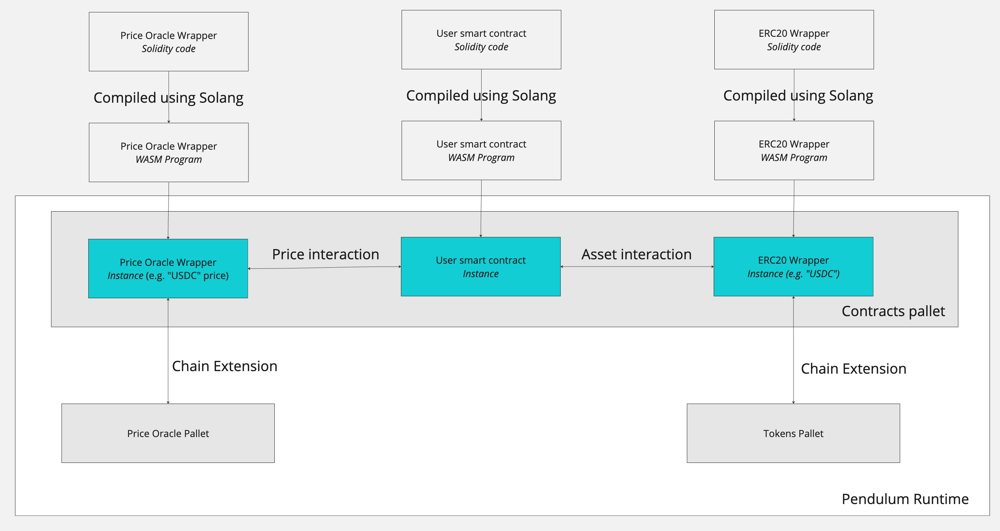

# Overview

This project is about enabling the interaction between smart contracts and on-chain asset and price data.
Using the Solang compiler, we can compile Solidity smart contracts to a WASM binaries, which can then be deployed on the
Contracts pallet.
The on-chain asset and price data is exposed by so-called chain extensions which facilitate the interaction between the
smart contract and the pallets.
Solang integrates special functions that can be used to interact with the chain extensions.
By using the chain extensions, we can interact with the on-chain asset and price data without the need to change the
smart contract implementation.

## Functional Requirements

### Roles

- User (Contract Caller) - A (human) user or a smart contract that expects to interact with a contract that implements
  the ERC-20 interface.

### Features

With the wrapper contracts you can:

- query the balance and price data from on-chain pallets
- transfer tokens to other accounts
- without the need to change the implementation of existing Solidity smart contracts (ie. users)

### Use Case

Existing DeFi smart contracts are written in Solidity and expect to interact with other smart contracts that implement
the ERC-20 interface.
These smart contracts are not aware of the fact that the token data is stored in on-chain pallets.
With using these wrapper contracts, fulfilling expected interfaces, we can facilitate the deployment of existing
Solidity smart contracts on the parachain.

## Technical requirements

This project is about enabling the interaction between smart contracts and on-chain asset data.
Using the Solang compiler, we can compile Solidity smart contracts to a WASM binaries, which can then be deployed on the
Contracts pallet.
The on-chain asset data is exposed by so-called chain extensions which facilitate the interaction between the smart
contract and the pallets.
Solang integrates special functions that can be used to interact with the chain extensions.

This project offers two wrapper contract: 1) a wrapper contract for the ERC-20 interface and 2) a wrapper contract for
price oracles adhering to the `IPriceOracleGetter` interface used in the Aave protocol.
The relevant data is not stored in the wrapper contracts itself.
They only implement the interface of the wrapped contract and forward the calls to the chain extension.

### Architecture Overview

The following figure provides a high-level overview of the architecture of the project.
It shows how a user smart contract (`User-SmartContract.sol`) would interact with the wrapper contracts to access
functionalities exposed by other runtime pallets.



### Contract Information

This section contains detailed information about the contracts used in this project.

#### ERC-20 Wrapper

The `erc20-wrapper.sol` contract is a Solidity smart contract that implements
the [IERC20](https://github.com/OpenZeppelin/openzeppelin-contracts/blob/master/contracts/token/ERC20/IERC20.sol)
interface.
It uses
Solang's [chain_extension](https://github.com/hyperledger/solang/blob/f9230fc5ab2d957e90153fdfaaa5701f241f6add/docs/language/builtins.rst#chain_extensionuint32-id-bytes-input-returns-uint32-bytes)
function to communicate with the `Tokens` pallet of the Pendulum runtime.
The usage of the chain extension is tailored to the chain extensions exposed by the Pendulum runtimes,
see [here](https://github.com/pendulum-chain/pendulum/blob/72ac4234b5b4ad5eed4a9d9f85215167f45b6f91/runtime/foucoco/src/lib.rs#L936-L1186).

The constructor of the `erc20-wrapper.sol` contract takes the following arguments:

- `name` - The name of the token.
- `symbol` - The symbol of the token.
- `decimals` - The number of decimals of the token.
- `variant` - The variant of the token. This is used to build the `CurrencyId` for the Pendulum runtime.
- `index` - The index of the variant of token. This is used to build the `CurrencyId` for the Pendulum runtime.
- `code` - The asset code of a Stellar asset. This is only used when building a Stellar variant of the `CurrencyId`.
- `issuer` - The issuer of a Stellar asset. This is only used when building a Stellar variant of the `CurrencyId`.

In order to be able to communicate with the chain extensions exposed by the Pendulum runtimes, we need to create
the `CurrencyId` for the token.
The `CurrencyId` enum is roughly defined as follows:

``` 
pub enum CurrencyId {
    Native, // variant 0
    XCM(u8), // variant 1
    Stellar { // variant 2
      StellarNative, // variant 2, index 0
      AlphaNum4 { code: Bytes4, issuer: Bytes32 }, // variant 2, index 1 
      AlphaNum12 { code: Bytes12, issuer: Bytes32 } // variant 2, index 2
    },
}
```

The `variant` hereby corresponds to the index in the outer enum, while the `index` corresponds to the inner enum.

#### Price Oracle Wrapper

The `price-oracle-wrapper.sol` contract is a Solidity smart contract that implements
the [IPriceOracleGetter](https://github.com/aave/aave-protocol/blob/4b4545fb583fd4f400507b10f3c3114f45b8a037/contracts/interfaces/IPriceOracleGetter.sol)
interface.
It uses the chain extensions exposed by the Pendulum runtimes to get access to on-chain price data.

The `price-oracle-wrapper.sol` contract takes an array of `OracleKey` structs in its constructor.
These `OracleKey`s are necessary so that the contract knows how to access the price data from the chain extension.
The `OracleKey` struct contains the following fields:

- `asset` - The address of the ERC-20 token for which the price should be retrieved.
- `blockchain` - The identifier of the blockchain for which the price should be retrieved.
- `symbol` - The symbol of the token on the given blockchain.

The combination of `blockchain` and `symbol` is used to uniquely identify the price data.

Multiple `OracleKey`s can be passed to the constructor so that the contract can retrieve prices for multiple tokens
without having to deploy a new contract per token.